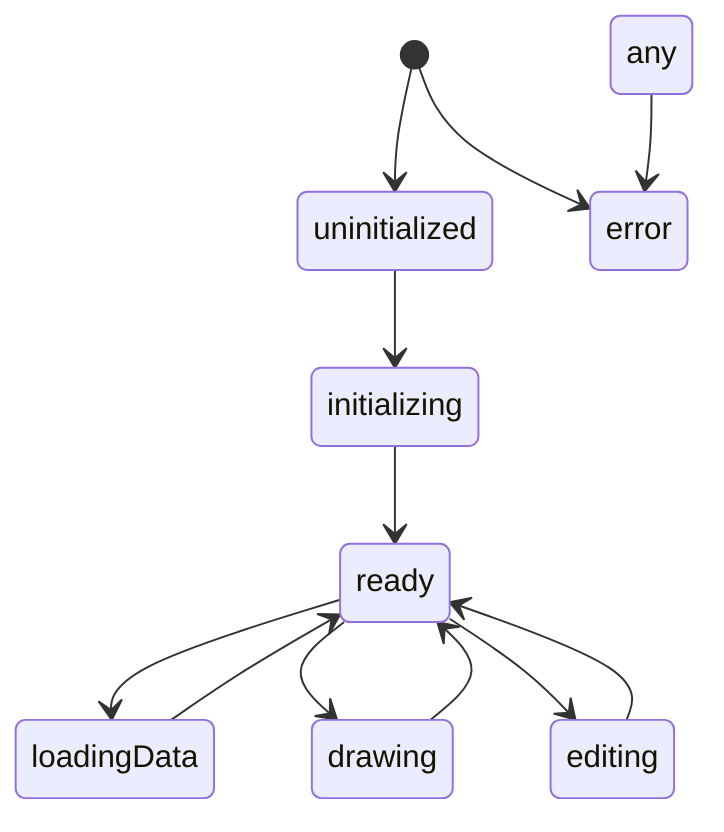

# ARCHITECTURE: Leaflet GeoKit

This document specifies the end-to-end architecture for a framework-agnostic, TypeScript-first web component for Leaflet + Leaflet.draw. It aligns with the initial plan in [implementation_plan.md](implementation_plan.md:1) and incorporates the approved decisions (Preset B).

## Decisions snapshot

- Name and directory
  - Package name: @florasync/leaflet-geokit
  - Location: repo root
- Bundling
  - Bundle leaflet and leaflet-draw JS/CSS into the library (no peer deps)
  - Inject styling into Shadow DOM
- Target and compatibility
  - Build target: ES2019, evergreen browsers (Chromium, Firefox, Safari modern)
- Developer ergonomics
  - Default log level: debug
  - Allow custom logger injection
- Tests
  - Vitest (unit/basic integration) included
  - Playwright e2e planned (not present in this repo)

## High-level design

- Public API remains framework-agnostic (Custom Element + DOM events + methods)
- Internals leverage TypeScript to enforce contracts; a dev overlay UI is planned
- Separation of concerns:
  - Custom Element host [LeafletDrawMapElement](src/components/LeafletDrawMapElement.ts:1)
  - Map lifecycle + Leaflet.draw bridge [MapController](src/lib/MapController.ts:1)
  - In-memory, id-centric GeoJSON store [FeatureStore](src/lib/FeatureStore.ts:1)
  - Logging utility [createLogger()](src/utils/logger.ts:1)
  - Shared types [public.ts](src/types/public.ts:1), [events.ts](src/types/events.ts:1)

### Component diagram

```mermaid
flowchart LR
  A[LeafletDrawMapElement (Custom Element)] --> B[MapController]
  %% Dev overlay planned
  %% A --> C[LeafletDrawMapView (Preact Dev Overlay)]
  B --> D[Leaflet Map + Leaflet.draw]
  B --> E[FeatureStore]
  E <--> D
  B -->|dispatch CustomEvent| A
  A -->|attributes/props| B
  %% C -->|status/diagnostics| A
```

### State sketch



## Public API

All interactions occur via the Custom Element host [LeafletDrawMapElement](src/components/LeafletDrawMapElement.ts:1).

### Attributes (string/boolean)

- Map and tiles
  - latitude, longitude, zoom
  - min-zoom, max-zoom
  - tile-url, tile-attribution
- Controls (boolean; presence = true)
  - draw-polygon, draw-polyline, draw-rectangle, draw-circle, draw-marker
  - edit-features, delete-features
- Behavior
  - read-only (boolean)
  - log-level: "trace" | "debug" | "info" | "warn" | "error" | "silent"
  - dev-overlay (boolean; reserved for future)

Attributes reflect to typed properties defined on [LeafletDrawMapElement](src/components/LeafletDrawMapElement.ts:1).

### Properties (typed)

- LeafletDrawMapElement.latitude: number
- LeafletDrawMapElement.longitude: number
- LeafletDrawMapElement.zoom: number
- LeafletDrawMapElement.minZoom?: number
- LeafletDrawMapElement.maxZoom?: number
- LeafletDrawMapElement.tileUrl: string
- LeafletDrawMapElement.tileAttribution?: string
- LeafletDrawMapElement.readOnly: boolean
- LeafletDrawMapElement.logLevel: LogLevel
- LeafletDrawMapElement.devOverlay: boolean

### Methods

- LeafletDrawMapElement.getGeoJSON(): Promise<FeatureCollection>
- LeafletDrawMapElement.loadGeoJSON(fc: FeatureCollection): Promise<void>
- LeafletDrawMapElement.clearLayers(): Promise<void>
- LeafletDrawMapElement.addFeatures(fc: FeatureCollection): Promise<string[]>
- LeafletDrawMapElement.updateFeature(id: string, feature: Feature): Promise<void>
- LeafletDrawMapElement.removeFeature(id: string): Promise<void>
- LeafletDrawMapElement.fitBoundsToData(padding?: number): Promise<void>
- LeafletDrawMapElement.fitBounds(bounds: [[number, number], [number, number]], padding?: number): Promise<void>
- LeafletDrawMapElement.setView(lat: number, lng: number, zoom?: number): Promise<void>
- LeafletDrawMapElement.exportGeoJSON(): Promise<FeatureCollection>

All methods log inputs/outputs and timing (debug level) via [createLogger()](src/utils/logger.ts:1).

### Events

- 'leaflet-draw:ready' → ReadyEventDetail
- 'leaflet-draw:created' → CreatedEventDetail
- 'leaflet-draw:edited' → EditedEventDetail
- 'leaflet-draw:deleted' → DeletedEventDetail
- 'leaflet-draw:error' → ErrorEventDetail
- 'leaflet-draw:ingest' → { fc: FeatureCollection, mode: 'load'|'add' } — dispatched before features are added; listeners can mutate detail.fc to transform input

Verbose lifecycle events (drawstart/drawstop/editstart/editstop) are planned but not emitted in this repo.

Event detail types live in [events.ts](src/types/events.ts:1) and are documented for consumers.

## Internal modules

### Custom Element host

- [LeafletDrawMapElement](src/components/LeafletDrawMapElement.ts:1)
  - Creates Shadow DOM and renders container(s)
  - Reflects attributes ↔ properties
  - Instantiates [MapController](src/lib/MapController.ts:1) on first connect; disposes on disconnect
  - Exposes public methods and re-dispatches controller events as CustomEvent
  - Accepts optional injected logger (property) falling back to [createLogger()](src/utils/logger.ts:1)

### Controller

- [MapController](src/lib/MapController.ts:1)
  - Responsibilities
    - Initialize Leaflet map against a provided container element
    - Create tile layer (tile URL + attribution)
    - Create [L.FeatureGroup](https://leafletjs.com/reference.html#featuregroup) to host drawn items
    - Build Draw control options based on [DrawControlsConfig](src/types/public.ts:1)
    - Attach Leaflet.draw events and translate to component events
    - Apply read-only mode (disable drawing/editing/remove)
    - Surface errors via 'leaflet-draw:error'
  - Interfaces with [FeatureStore](src/lib/FeatureStore.ts:1) for add/update/remove and id mapping
  - Exposes procedural methods invoked by the element (fit bounds, setView, CRUD passthrough)

### GeoJSON Feature Store

- [FeatureStore](src/lib/FeatureStore.ts:1)
  - Ensures every feature has a stable id:
    - Use feature.id if present; else feature.properties.id; else generate uuid v4
  - APIs
    - [add(fc: FeatureCollection): string[]](src/lib/FeatureStore.ts:1)
    - [update(id: string, feature: Feature): void](src/lib/FeatureStore.ts:1)
    - [remove(id: string): void](src/lib/FeatureStore.ts:1)
    - [toFeatureCollection(): FeatureCollection](src/lib/FeatureStore.ts:1)
    - [bounds(): L.LatLngBounds | null](src/lib/FeatureStore.ts:1)
  - Maintains bidirectional maps: id → L.Layer and L.Layer → id to translate edit/delete events

### Dev Overlay (planned)

- A dev/status overlay is planned but not implemented in this repo.

### State

- [MapState](src/state/types.ts:1) exists for potential future overlay/state reporting.

### Logging

- LogLevel = 'trace' | 'debug' | 'info' | 'warn' | 'error' | 'silent'
- Logger: level + methods
- Factory [createLogger(name: string, level: LogLevel)](src/utils/logger.ts:1)
  - Namespaced loggers:
    - component:leaflet-draw
    - controller
    - feature-store
  - Structured messages: include counts, ids, bbox, durations
  - Configurable via attribute log-level and runtime property override; supports custom injection

## Types

- [public.ts](src/types/public.ts:1)
  - [MapConfig](src/types/public.ts:1)
  - [DrawControlsConfig](src/types/public.ts:1)
  - Re-exports of GeoJSON Feature, FeatureCollection, Geometry
- [events.ts](src/types/events.ts:1)
  - [CreatedEventDetail](src/types/events.ts:1) { layerType: 'polygon' | 'polyline' | 'rectangle' | 'circle' | 'marker'; geoJSON: Feature; id: string }
  - [EditedEventDetail](src/types/events.ts:1) { geoJSON: FeatureCollection; ids: string[] }
  - [DeletedEventDetail](src/types/events.ts:1) { geoJSON: FeatureCollection; ids: string[] }
  - [ReadyEventDetail](src/types/events.ts:1) { bounds?: [[number, number], [number, number]] }
  - [ErrorEventDetail](src/types/events.ts:1) { message: string; cause?: unknown }

## File layout (this repo)

- Library
  - package.json, vite.config.ts, tsconfig.json, README.md, ARCHITECTURE.md
  - src/index.ts
  - src/components/LeafletDrawMapElement.ts
  - src/lib/MapController.ts
  - src/lib/FeatureStore.ts
  - src/lib/leaflet-assets.ts
  - src/types/public.ts, src/types/events.ts
  - src/utils/logger.ts, src/utils/geojson.ts
  - src/state/types.ts
- Tests and examples
  - tests/element.spec.ts
  - index.html (dev harness)

## Build and bundling

- [vite.config.ts](vite.config.ts:1)
  - Library mode with UMD and ESM outputs
  - Bundle leaflet and leaflet-draw (mark neither as external)
  - Include CSS via Vite CSS handling; inject into Shadow DOM at runtime
  - Ensure asset URLs for Leaflet markers are imported via [leaflet-assets.ts](src/lib/leaflet-assets.ts:1) and wired through L.Icon.Default
  - Build target: es2019
  - Define exports fileName: 'leaflet-geokit'
- [package.json](package.json:1)
  - "type": "module"
  - "main": "./dist/leaflet-geokit.umd.js"
  - "module": "./dist/leaflet-geokit.es.js"
  - "types": "./dist/types/index.d.ts"
  - "exports" mapping for import/require and types
  - "sideEffects": ["**/*.css"] to preserve CSS
  - Scripts: dev, build, test:unit, test:e2e, lint, typecheck, docs
- [tsconfig.json](tsconfig.json:1)
  - Strict true; DOM libs; JSX=react-jsx with "jsxImportSource": "preact"
  - Declarations enabled; path aliases for "src/\*"

## Leaflet integration specifics

- Initialization sequence in [MapController](src/lib/MapController.ts:1)
  1. Create map on container element
  2. Add tile layer (tile-url + tile-attribution)
  3. Create drawn items FeatureGroup and add to map
  4. Configure Draw control dynamically from [DrawControlsConfig](src/types/public.ts:1)
  5. Install event listeners: CREATED, EDITED, DELETED
  6. Respect read-only: hide or disable draw/edit/remove UI and interactions
  7. Dispatch 'leaflet-draw:ready' with initial bounds if data exists
- CSS and icons
  - Import Leaflet and Leaflet.draw CSS as strings and inject inside Shadow DOM
  - Use [leaflet-assets.ts](src/lib/leaflet-assets.ts:1) to resolve default marker icons via URL imports
- Data loading
  - On LeafletDrawMapElement.loadGeoJSON(): clear and add via FeatureStore.add(); it does not auto-fit

## FeatureStore details

- ID assignment strategy
  - Prefer feature.id (string or number coerced to string)
  - Else feature.properties.id (string/number)
  - Else generate uuid v4
- Geometry mapping
  - Point → L.Marker
  - LineString/Polygon/Multi\* → appropriate vector layers via L.geoJSON factory; collect produced layers per feature id
- Synchronization
  - On CREATED: assign id, add layer(s), dispatch event with id
  - On EDITED: find ids for affected layers, update GeoJSON by reading back geometry from layers
  - On DELETED: remove id(s) and layers; dispatch ids in event detail
- Export
  - [toFeatureCollection()](src/lib/FeatureStore.ts:1) returns normalized snapshot
  - [bounds()](src/lib/FeatureStore.ts:1) computes LatLngBounds across all layers

## Events and payloads (detailed)

- 'leaflet-draw:created' → [CreatedEventDetail](src/types/events.ts:1)
  - { id, layerType, geoJSON }
- 'leaflet-draw:edited' → [EditedEventDetail](src/types/events.ts:1)
  - { ids, geoJSON }
- 'leaflet-draw:deleted' → [DeletedEventDetail](src/types/events.ts:1)
  - { ids, geoJSON }
- 'leaflet-draw:ready' → [ReadyEventDetail](src/types/events.ts:1)
  - { bounds? }
- 'leaflet-draw:error' → [ErrorEventDetail](src/types/events.ts:1)
  - { message, cause? }

All dispatch paths log at debug level with structured context.

## Dev Overlay

Planned feature; not implemented in this repo.

## Testing strategy

- Unit (Vitest)
  - DOM env: happy-dom
  - tests/element.spec.ts: lifecycle and reflection/basic API smoke
- Additional unit/e2e tests are planned but not present in this repo.

## Documentation

- [README.md](README.md:1)
  - Installation, basic usage, attributes table, methods table, event details
  - Typed signatures referencing [public.ts](src/types/public.ts:1) and [events.ts](src/types/events.ts:1)
  - Example: listening to events, loading data, CRUD by id
- API docs via TSDoc + typedoc; output linked from README
- Changelog planned following Keep a Changelog

## Accessibility and UX notes

- Respect host sizing; :host display: block and 100% width/height for internal container in [host.css](src/styles/host.css:1)
- Keyboard zoom/pan rely on Leaflet defaults; document known shortcuts
- Focus outlines and high-contrast support for Dev Overlay
- Theming: host exposes CSS parts/tokens for overlay (future enhancement)

## Performance considerations

- Incremental updates for edits avoid full re-render
- Large datasets: rely on L.geoJSON; clustering is out-of-scope for v1 (document limitation)
- Avoid layout thrash in overlay; batch state updates (when overlay exists)

## Error handling

- Wrap Leaflet initialization and event handlers with try/catch; send 'leaflet-draw:error'
- Degrade gracefully if tile layer fails; keep editing local layers functional where possible

## Security and SSR

- Element is browser-only; guards around window/document access
- SSR builds should import lazily; document usage in README

## Milestones (execution plan)

- M0: Scaffold project
  - [package.json](package.json:1), [tsconfig.json](tsconfig.json:1), [vite.config.ts](vite.config.ts:1)
  - Dev server, build outputs (UMD + ESM)
- M1: Element + Controller + CSS/Assets
  - Shadow DOM with injected CSS
  - Map init, tile layer, FeatureGroup, Draw control
  - Ready event and logging
- M2: FeatureStore + Event bridge + Public methods
  - CRUD by id, bounds, get/load/clear
  - created/edited/deleted detail payloads
- M3: Dev Overlay + Logging polish
  - Status indicators, toggles
  - Structured logs and timings
- M4: Tests + Examples + Docs
  - Vitest unit/integration and Playwright e2e green
  - Example page and README complete
  - Typedoc generated

## Example usage (public API)

HTML

- Include built JS bundle on the page; size the element via CSS
- Add attributes to enable controls and configure map

JS

- Listen for 'leaflet-draw:\*' events; call [LeafletDrawMapElement.loadGeoJSON()](src/components/LeafletDrawMapElement.ts:1) and [LeafletDrawMapElement.getGeoJSON()](src/components/LeafletDrawMapElement.ts:1) to move data in/out

Refer to [README.md](README.md:1) for complete examples.
