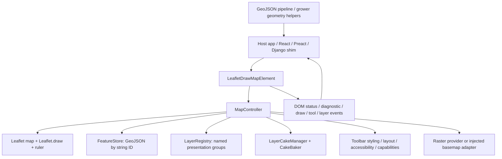

# Architecture: Leaflet GeoKit

This is a map of the implemented library, not a future implementation plan.
GeoKit exposes a framework-agnostic custom element backed by Leaflet and
Leaflet.draw. The canonical tag is `<leaflet-geokit>`; `<leaflet-draw-map>` is a
registered compatibility alias. Host applications own persistence, authentication,
vendor credentials, and framework UI.

For task-oriented examples start with [integration recipes](docs/integration-recipes.md).
The [README](README.md) describes the public API; the source contracts are
[public.ts](src/types/public.ts), [events.ts](src/types/events.ts), and
[layers.ts](src/types/layers.ts).

## Runtime boundaries


```mermaid
flowchart TD
  Host[Host app / React / Preact / Django shim] --> Element[LeafletDrawMapElement]
  Element --> Controller[MapController]
  Controller --> Leaflet[Leaflet map + Leaflet.draw + ruler]
  Controller --> Store[FeatureStore: GeoJSON by string ID]
  Controller --> Registry[LayerRegistry: named presentation groups]
  Controller --> Cake[LayerCakeManager + CakeBaker]
  Controller --> Toolbar[Toolbar styling / layout / accessibility / capabilities]
  Controller --> Provider[Raster provider or injected basemap adapter]
  Element --> Events[DOM status / diagnostic / draw / tool / layer events]
  Events --> Host
  Pipeline[GeoJSON pipeline / grower geometry helpers] --> Host
```

### Custom element and lifecycle

[LeafletDrawMapElement](src/components/LeafletDrawMapElement.ts) owns Shadow DOM,
configuration attributes/properties, style injection, status snapshots, and the
public method/event bridge. On connection it constructs and initializes a
controller; on disconnection it destroys the controller and removes its listeners.
Give the host an explicit height and attach readiness/error listeners before
connecting it. Custom-element registration alone is not map readiness.

Public status states are `uninitialized`, `initializing`, `ready`, `loading`, and
`error`. `leaflet-geokit:status` reports readiness, busy state and feature count;
`leaflet-geokit:diagnostic` and `leaflet-draw:error` expose failures. Recoverable
errors can leave the map usable. `dev-overlay` is a compatibility flag, not an
implemented debugging overlay. Logging defaults to `debug` and supports a custom
logger; do not assume diagnostic output is appropriate for sensitive data.

### Controller and map ownership

[MapController](src/lib/MapController.ts) owns the Leaflet map, drawn FeatureGroup,
feature-to-rendered-layer bindings, basemap, draw/ruler controls, active tool
commands, and editing sessions. It translates Leaflet changes into store updates
and public callbacks. It also manages structural reconfiguration, read-only tool
behavior, snapping, measurement overlays and cleanup. Integrations should use the
element API rather than reach into the Shadow DOM or private Leaflet handlers.

[FeatureStore](src/lib/FeatureStore.ts) is map-agnostic: it stores GeoJSON by string
ID, provides CRUD and computes coordinate bounds. It does **not** own Leaflet
layers or bidirectional Leaflet bindings. IDs come from `feature.id`, then
`properties.id`, then generated UUIDs. Legacy store operations use shallow copies;
clone a snapshot when retaining an independent editing baseline.

[LayerRegistry](src/lib/LayerRegistry.ts) stores detached presentation records:
name, kind, visibility, order, feature membership and portable style. Hiding a
group removes its rendered features from the editable group, not the data store.
The `base` record is reserved. Default GeoJSON export is feature data;
`preserveLayers: true` explicitly persists registry metadata. See
[named layers and layer-cake sessions](docs/layers.md) for invariants and restoration.

## Data and geometry

The element exposes `getGeoJSON`, `importGeoJSON`, `exportGeoJSON`, legacy
`loadGeoJSON`/`addFeatures`, per-feature CRUD and view-fitting helpers. Import
supports replace/add behavior, optional validation, named groups and optional
layer restoration. `loadGeoJSON` replaces without automatically fitting bounds.

[geojson-pipeline.ts](src/utils/geojson-pipeline.ts) implements validation,
normalization, text/URL ingestion, diagnostic export, diff and patch helpers.
Validation is opt-in on map imports (`validate: true`); its preflight runs after
the ingest hook and before destructive replacement. Multi/collection geometries
expand into editing features, with reserved provenance for diagnostic source
export. Validation is not a general GIS topology/reprojection service. Read the
[GeoJSON pipeline contract](docs/geojson-pipelines.md) for ID, provenance,
validation and legacy export differences.

[grower-geometry.ts](src/utils/grower-geometry.ts) supplies Turf-backed geometry
operations, measurements and guides, exported by the root and external entries.
See [grower geometry](docs/grower-geometry.md) and
[snapping and measurements](docs/snapping-and-measurements.md). These utilities
are distinct from the controller's interactive tools: calculating geometry does
not automatically import it or create a visible map layer.

[LayerCakeManager](src/lib/layer-cake/LayerCakeManager.ts) manages concentric-circle
draft sessions. [CakeBaker](src/lib/layer-cake/CakeBaker.ts) produces saved core/ring
polygons. The public session API allows external controls to update radii, style
and name, then save or cancel. A saved polygon group is not an editable draft
session; see [layers](docs/layers.md).

## Tools, events and host-owned UI

Tool activation is public: `activateTool`, `triggerTool`, `deactivateTool`, and
`leaflet-geokit:tool-command` share a correlated lifecycle. Command acknowledgement
is not necessarily interaction completion. Read
[tool lifecycle](docs/tool-lifecycle.md) for commanded/started/completed/cancelled/
failed events and [tool capabilities](docs/tool-capabilities.md) for readiness,
read-only, selection and provider prerequisites.

Existing `leaflet-draw:ready`, `created`, `edited`, `deleted`, `ingest`, `export`,
and `error` events coexist with the newer tool and layer event families.
`leaflet-geokit:layers-changed` drives a host sidebar;
`leaflet-geokit:layer-style-request` is synchronously cancelable so a host can
replace the built-in style panel. Listen on the element: not every legacy event
bubbles. Event constants and payload types are exported from root and external.

Managed `toolbarGroups` and `toolButtonConfig` are data-driven; visual customization
uses CSS custom properties, parts, named slots and optional trusted renderers.
Do not depend on generated Leaflet class order or private DOM layout. Dedicated
contracts are maintained in:

- [Toolbar styling](docs/toolbar-styling.md): tokens, parts, states, icons and slots.
- [Toolbar layout](docs/toolbar-layout.md): zones, responsive placement and overflow.
- [Accessibility](docs/accessibility.md): labels, focus, keyboard and touch behavior.

## Providers and security

[TileProviderFactory](src/lib/TileProviderFactory.ts) retains OSM/HERE and custom
raster URL behavior. [providers.ts](src/lib/providers.ts) exports raster factories,
a dependency-injected MapLibre basemap shim, and configuration diagnostics.
`setBasemapAdapter` swaps only the basemap after readiness; geometry and
Leaflet.draw remain owned by GeoKit. Reconnection restores raster configuration.

`DrawEngineAdapter` is a design port, not an implemented replacement drawing
engine. The MapLibre seam does not bundle a WebGL renderer, PMTiles transport,
offline cache, Google Maps support or vendor provisioning. The
[provider guide](docs/providers.md) describes the optional bridge, teardown,
attribution and production-verification obligations; the
[Google adapter spike](docs/google-maps-adapter-spike.md) records a separate study.

Treat icon/popover HTML, attribution, theme CSS and adapter code as trusted host
input. Sanitize untrusted content. Browser keys are visible even when assigned
through properties; never ship server credentials. Hosts own URL allowlists,
CORS, upload limits, persistence authorization and concurrency controls.

## Package entries and SSR

[package.json](package.json) is authoritative for supported subpaths.

| Entry                               | Responsibility                                                       | Server import boundary                                                 |
| ----------------------------------- | -------------------------------------------------------------------- | ---------------------------------------------------------------------- |
| `@florasync/leaflet-geokit`         | Bundled browser component, types, pipeline/geometry/provider helpers | Browser-only runtime registration                                      |
| `/external`                         | Browser component with Leaflet/Draw/ruler JS externalized            | Browser-only; not an SSR entry                                         |
| `/react`, `/preact`                 | Additive framework wrappers; host-owned Leaflet assets               | Wrapper module import is SSR-safe; registration is deferred to effects |
| `/react-bundled`, `/preact-bundled` | Self-provisioned framework wrappers                                  | Eager root import; browser-only                                        |
| `/django`                           | Browser textarea/form bridge (`initDjangoGeokit`)                    | Eager root import; browser-only                                        |

Both browser component entries directly access `customElements`; the element
extends `HTMLElement` and its runtime imports the mapping stack. Pure helper
implementations do **not** make a root named import SSR-safe. There is no exported
`/utils`, `/geojson`, `/providers` or `/ssr` runtime subpath. Type-only root imports
are erased by TypeScript. Use client-only dynamic imports for browser entries.

The additive wrappers use [ensure-element.ts](src/shims/ensure-element.ts) to load
the root lazily in the browser. Their SSR-safe module import does not mean a map
renders on the server. React/Preact runtimes remain consumer-provided optional
peers. See the [integration recipes](docs/integration-recipes.md) and existing
[React](docs/shims/react.md), [Preact](docs/shims/preact.md), and
[Django](docs/shims/django.md) guides.

## Build, assets and verification

The build emits declarations and uses separate Vite configurations for the root,
external, Django and framework entries. Root output includes ESM/UMD; the other
exported entries are ESM. Vite targets ES2019. Bundled mode injects Leaflet/Draw
styles inside Shadow DOM and configures marker assets. External hosts must supply
a compatible shared Leaflet stack; opting out of injected styles does not make
ordinary document CSS cross the Shadow DOM boundary.

Vitest unit/integration tests and Playwright browser suites are present, not
planned work. [tests](tests) cover stores, pipelines, providers, lifecycle,
wrappers and presentation contracts; [e2e](e2e) exercises real map interactions.
HTML harnesses include `irrigation-draw-mode.html`, `layer-manager.html`,
`external.html`, and the React/Preact variants.

```sh
npm run typecheck
npm run test:unit
npm run build
npm run test:e2e
```

Use `npm run test:unit:focused -- tests/<suite>.spec.ts` for a targeted check
without global coverage thresholds. Specialized Playwright configs exist for
layers, providers, layout, touch, accessibility, capabilities, snapping and
release checks. Their fixture-based passes do not validate live vendor service
availability. [PUBLISHING.md](PUBLISHING.md) owns release instructions and
[CHANGELOG.md](CHANGELOG.md) records shipped changes.
