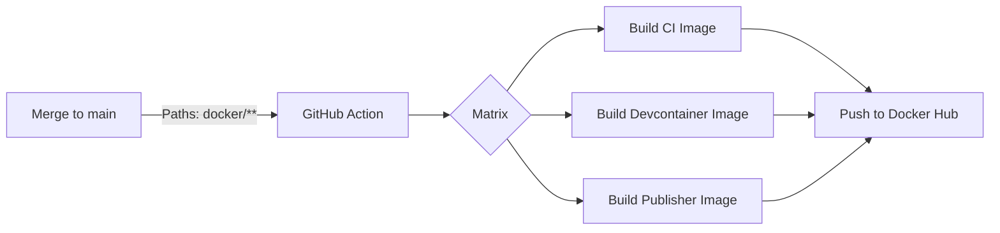

# Feature Request: Automated Docker Hub Publishing

## Overview

Implement a GitHub Actions workflow to automatically build and push Docker images to Docker Hub whenever the Dockerfiles in the `./docker` directory are modified and merged into the `main` branch. This ensures that our CI, devcontainer, and publisher images are always up-to-date and available for use.

## Goals

1.  **Automated Builds**: Trigger builds automatically on merges to `main` that affect the `./docker` directory.
2.  **Multi-Image Support**: Handle all Dockerfiles in `./docker` (`Dockerfile.CI`, `Dockerfile.devcontainer`, `Dockerfile.publisher`).
3.  **Secure Publishing**: Use GitHub Secrets to manage Docker Hub credentials and repository names.
4.  **Efficient Tagging**: Implement a consistent tagging strategy (e.g., `latest` and version-based tags).

## Proposed GitHub Actions Workflow

### Trigger Configuration

The workflow should trigger on pushes to the `main` branch, specifically filtering for changes in the `docker/` directory.

```yaml
on:
  push:
    branches:
      - main
    paths:
      - "docker/**"
```

### Matrix Strategy

Use a matrix to build all three images in parallel.

```yaml
jobs:
  build-and-push:
    runs-on: ubuntu-latest
    strategy:
      matrix:
        include:
          - name: ci
            file: docker/Dockerfile.CI
          - name: devcontainer
            file: docker/Dockerfile.devcontainer
          - name: publisher
            file: docker/Dockerfile.publisher
```

### Required Secrets

- `DOCKERHUB_USERNAME`: Your Docker Hub username.
- `DOCKERHUB_TOKEN`: A Docker Hub Personal Access Token (PAT).
- `DOCKERHUB_REPO_PREFIX`: The prefix for the repository names (e.g., `florasync/leaflet-geokit`).

## Technical Hurdles

1.  **Path-Specific Triggers**: While we can trigger the workflow when _any_ file in `docker/` changes, we might want to avoid rebuilding _all_ images if only one Dockerfile was modified. However, for simplicity and consistency, rebuilding all three on any change in that directory is a safe starting point.
2.  **Tagging Logic**: Deciding whether to tag with the `package.json` version or just `latest`. Using both is usually best practice.
3.  **Build Context**: Ensuring the build context is correctly set (usually the root of the repo) so that Dockerfiles can access necessary scripts or files if needed.

## Implementation Plan

1.  **Create Workflow File**: Add `.github/workflows/docker-publish.yml`.
2.  **Configure Docker Metadata**: Use `docker/metadata-action` to handle tagging and labeling.
3.  **Setup Docker Buildx**: Use `docker/setup-buildx-action` for multi-platform support (if needed) and better caching.
4.  **Login to Docker Hub**: Use `docker/login-action`.
5.  **Build and Push**: Use `docker/build-push-action` to perform the actual build and push.

## Architecture Diagram



---

**Status**: Proposed
**Priority**: High
**Related**: ./docker directory, GitHub Actions
