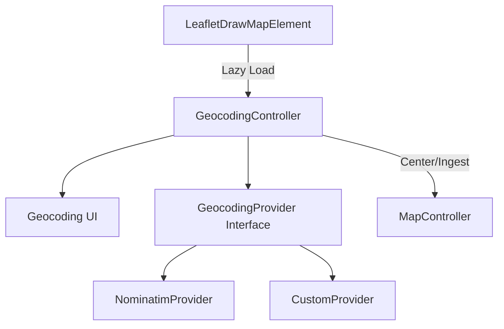

# Feature Request: First-Class Geocoding Support

## Overview

Integrate geocoding (search) functionality directly into the `<leaflet-geokit>` web component as an optional, lazy-loaded feature. This will allow users to enable a search bar that can find addresses and locations, center the map on them, and optionally ingest the resulting geometry as a GeoJSON feature.

This feature should mirror the functionality currently implemented in the dev harness but as a robust, configurable part of the component's core.

## Goals

1.  **Optional & Lazy-Loaded**: The geocoding logic and UI should only be loaded if the feature is enabled, keeping the base bundle size minimal.
2.  **Nominatim by Default**: Provide out-of-the-box support for OpenStreetMap's Nominatim service.
3.  **Extensible Provider Model**: Allow users to plug in other geocoding providers (Here, Mapbox, etc.) via a standard interface.
4.  **Configurable UI**: Provide a default search UI within the component while allowing for customization or external control.
5.  **Seamless Integration**: Automatically handle map centering, zooming, and GeoJSON ingestion of search results.

## Proposed API

### Attributes

- `geocoding`: Boolean. Enables the default geocoding UI.
- `geocoding-provider`: String. The provider to use (default: `"nominatim"`).
- `geocoding-placeholder`: String. Placeholder text for the search input.
- `geocoding-ingest`: Boolean. If true, search results with valid geometry are automatically added to the map.
- `geocoding-options`: JSON string. Provider-specific configuration (API keys, bounds, etc.).

### Events

- `leaflet-geokit:geocoding-start`: Fired when a search is initiated.
- `leaflet-geokit:geocoding-results`: Fired when results are returned.
- `leaflet-geokit:geocoding-error`: Fired when a search fails.

## Technical Hurdles

1.  **Bundle Size & Code Splitting**: We must ensure that the geocoding logic (which may include UI components and fetch logic) is split into a separate chunk and only loaded when `geocoding` is enabled.
2.  **Shadow DOM UI**: Placing a search bar over the map inside the Shadow DOM requires careful CSS positioning to ensure it doesn't interfere with Leaflet controls or the drawing experience.
3.  **Provider Abstraction**: Designing a clean interface that works for both simple REST-based geocoders (like Nominatim) and more complex SDK-based ones (like Google Maps) is critical.
4.  **Rate Limiting & Attribution**: Different providers have different requirements for attribution and rate limiting. The component must handle these gracefully.

## Implementation Plan (Pragmatic Approach)

### Phase 1: Provider Interface & Nominatim

- Define a `GeocodingProvider` interface in `src/types/geocoding.ts`.
- Implement a `NominatimProvider` that handles the fetch and normalization logic.
- Create a `GeocodingController` that manages the state and interaction between the UI and the map.

### Phase 2: Lazy Loading & UI

- Use dynamic `import()` in `LeafletDrawMapElement` to load the `GeocodingController` only when the `geocoding` attribute is detected.
- Implement a default, minimal search UI that can be toggled on/off.
- Use CSS variables to allow users to theme the search bar.

### Phase 3: Ingestion & Events

- Integrate with `MapController` to handle centering the map and adding features from search results.
- Wire up the proposed events to allow host applications to react to search activity.

## Example Usage

```html
<leaflet-geokit
  geocoding
  geocoding-ingest
  geocoding-placeholder="Find a property..."
></leaflet-geokit>
```

Or with a custom provider (conceptual):

```javascript
const el = document.querySelector("leaflet-geokit");
el.geocodingProvider = new MyCustomProvider({ apiKey: "..." });
```

## Architecture Diagram (Conceptual)



---

**Status**: Proposed
**Priority**: Medium
**Related**: Dev Harness Geocoder Implementation
